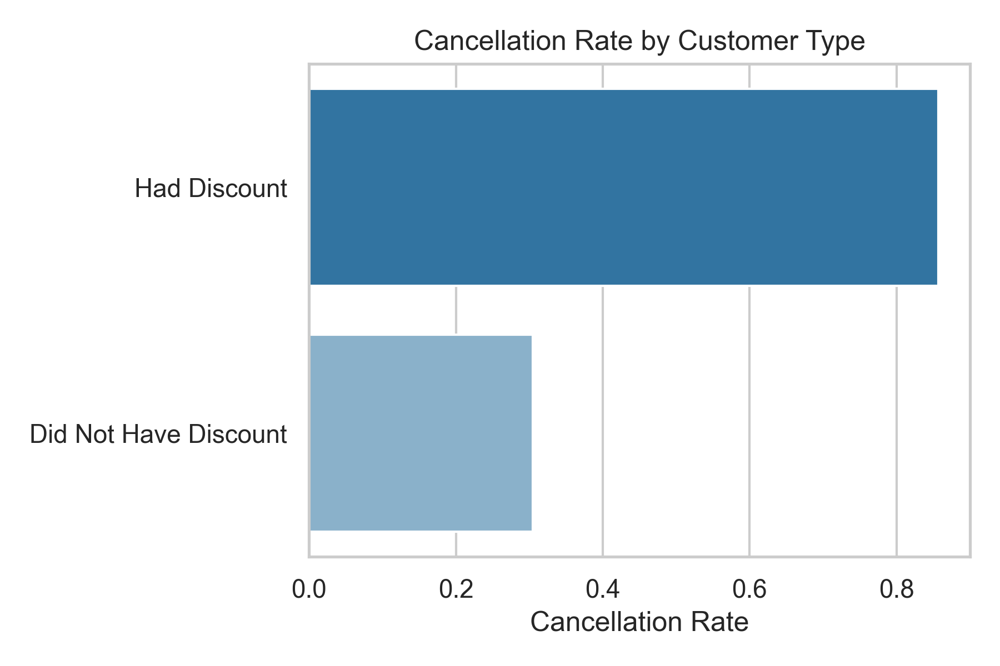
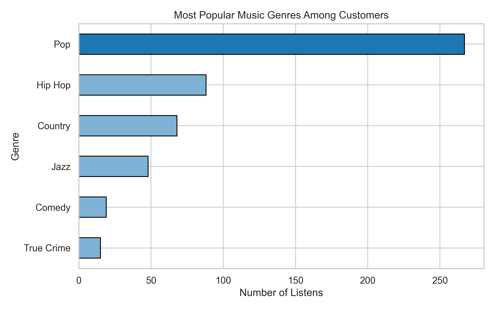
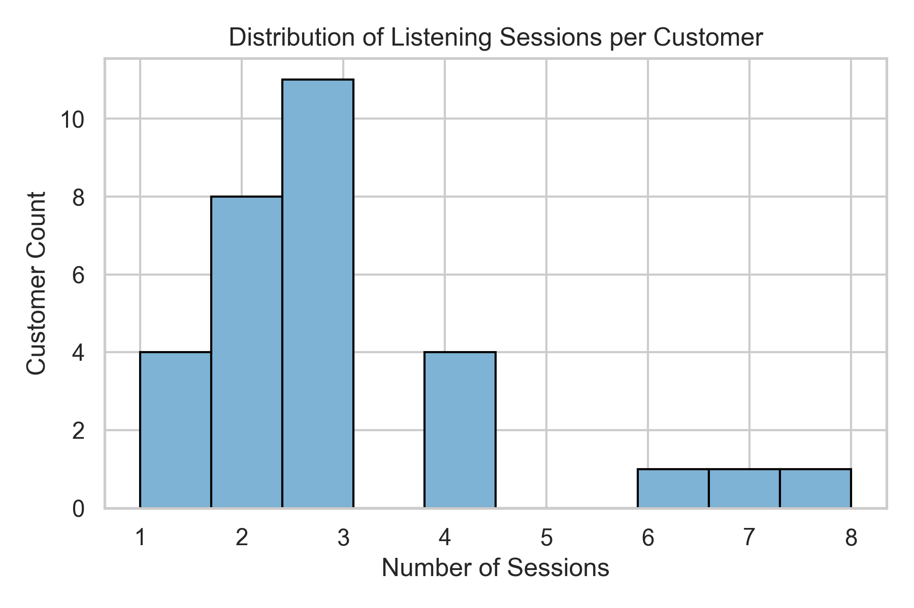

# 🎧 Maven Music Customer Analysis

## 📊 Project Overview
This project explores **customer behavior and churn patterns** for *Maven Music*, a fictional streaming platform.  
The goal is to uncover what drives customer cancellations, how discounts affect retention, and what music genres are most popular.

---

## 🧱 Project Workflow

### **1. Data Ingestion**
Imported multiple data sources:
- `maven_music_customers.csv`
- `maven_music_listening_history.xlsx`
- Audio and session data from additional Excel sheets.

### **2. Data Cleaning**
Steps performed:
- Converted date columns (`Member Since`, `Cancellation Date`) into datetime format.
- Removed `$` symbols and converted `Subscription Rate` to numeric.
- Fixed inconsistent values (`Pop Music` → `Pop`, `$99.99` → `$9.99`).
- Filled missing `Subscription Plan` values (`Basic (Ads)`).
- Converted `Discount?` into numeric format (1 = Yes, 0 = No).
- Created new columns:
  - `Cancelled` → 1 if cancellation date exists, else 0  
  - Cleaned `Email` → removed “Email:” prefix  

---

## 🧮 **3. Exploratory Data Analysis (EDA)**

### **Customer Cancellations**
- Average membership duration before cancellation: **~1.5 months**
- Customers **with discounts** had a cancellation rate of **85.7%**
- Customers **without discounts** had a cancellation rate of **30.4%**

This suggests that **discounted users are more likely to churn early**, possibly due to short-term promotional attraction.

### **Listening Behavior**
- **Pop** was the most popular genre, followed by Rock and Hip-Hop.
- Listening frequency varied greatly — some users were highly engaged, while others rarely listened.

---

## 🖼️ Visual Insights

### 📊 1. Cancellation Rate by Customer Type
Customers who received **discounts** canceled far more frequently (~85%) than those who did not (~30%).

---

### 🎧 2. Most Popular Genres
**Pop** dominates listening preferences, followed by **Rock** and **Hip-Hop**.

---

### 🎵 3. Listening Sessions per Customer
Customers show varying levels of engagement — some listen occasionally, while others stream frequently.

### 4. Relationships between numeric variables:

🖼️ [View Correlation Heatmap](./images/correlation_heatmap.png)

This heatmap helps identify which variables may be good predictors for customer churn.

---

## 📈 Key Insights

| Insight | Description |
|----------|-------------|
| 💸 High Discount Cancellation Rate | 85.7% of discounted customers canceled early |
| 🧍 Lower No-Discount Cancellation Rate | 30.4% of regular customers canceled |
| 🎵 Popular Genre | **Pop** is the most frequently played |
| ⏳ Average Membership Duration | ~1.5 months before cancellation |

---

## 🧰 Tools & Libraries
- **Python**
- **Pandas** – Data ingestion and transformation  
- **NumPy** – Numeric computation  
- **Matplotlib & Seaborn** – Visualization and styling  

---

## 👨‍💻 Author
**Sharanch Mukhia**  
📧 [saranchmukhia@gmail.com](mailto:saranchmukhia@gmail.com)

